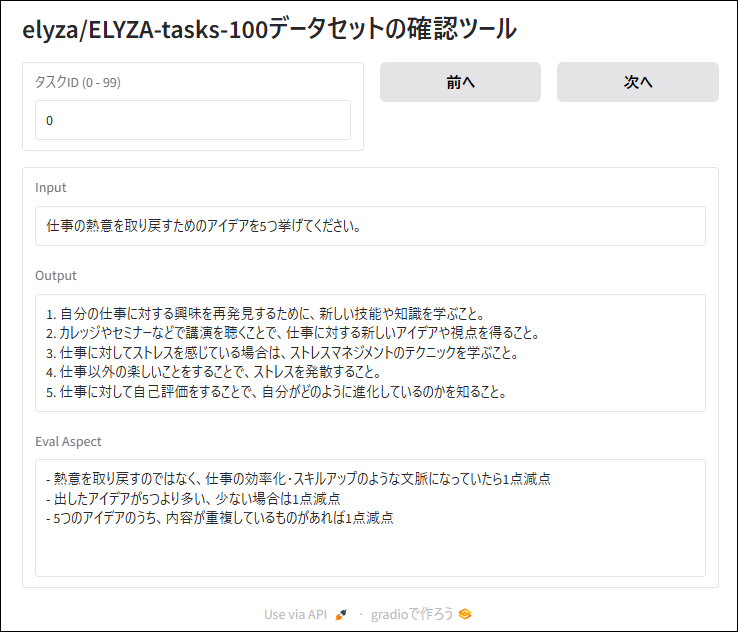

# elyza100_viewer

[elyza/ELYZA-tasks-100](https://huggingface.co/datasets/elyza/ELYZA-tasks-100)データセットの確認ツールです

## 概要

- elyza/ELYZA-tasks-100データセットの内容を簡単に確認できます
- データセットはdatasetsライブラリを通じて自動的に読み込まれます
- 確認できる形式は`{"input": "(入力)", "output": "(出力)", "eval_aspect": "(採点基準)"}`のjsonl形式となります

## ライセンス

- MIT License

## 動作環境

- WSL, Linux, Windows, Macなど （GPU不要です）
- [](http://colab.research.google.com/github/TaroNakasendo/elyza100_viewer/blob/main/google_colab.ipynb)　← クリックするとGoogle Colabでノートブックが開きます

## インストール

```sh
# git clone
git clone https://github.com/TaroNakasendo/elyza100_viewer.git
cd elyza100_viewer

# 仮想環境作成 (WSL, Linuxの場合)
python3 -m venv .venv --upgrade-deps
. .venv/bin/activate
pip install -r requirements.txt
```

### 起動方法

```sh
python main.py
```

- 実行後、ブラウザで<http://localhost:7860>を開くと下記のような画面が開きます
- `前のタスク`および`次のタスク`ボタンをクリックして前、次のタスクに移動できます
- キーボードの`左矢印キー`および`右矢印キー`を押下しても前、次のタスクに移動できます
- `タスクID`を指定することで、そのタスクIDのタスクを表示できます
- 終了するには`Ctrl + C`キーを押下してください

### 実行例




## 変更履歴

- 2024/12/08 初版リリース

以上